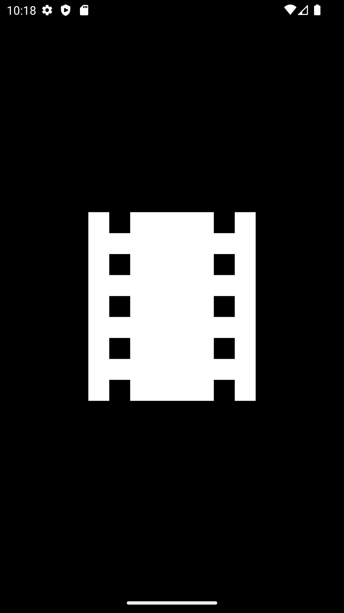
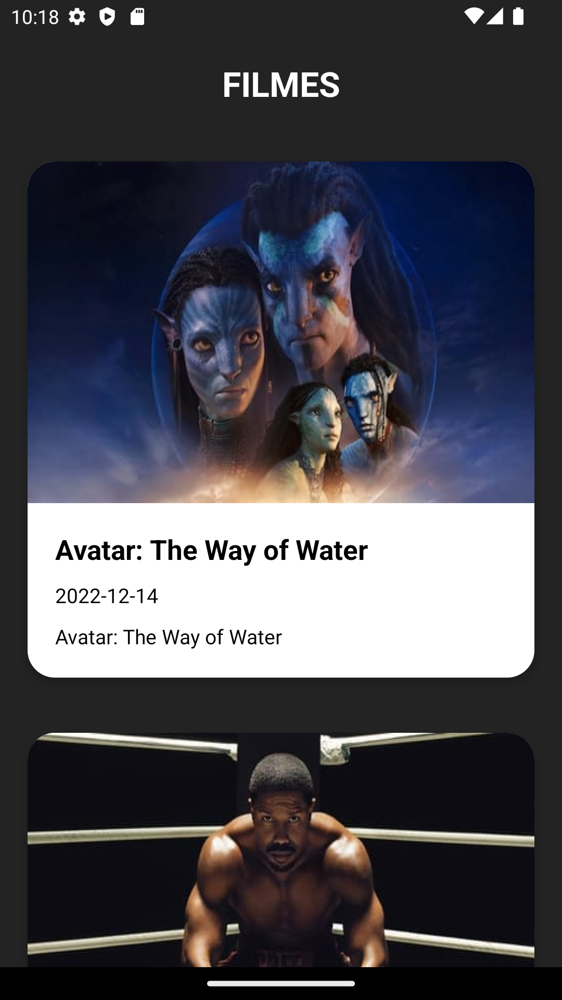
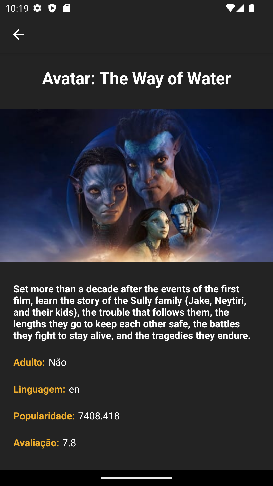

# Filmes App

Aplicativo Android nativo desenvolvido em Kotlin que consome a API REST do TMDB e apresenta informações de filmes utilizando arquitetura MVVM.

<p align="center">
  
  
  
</p>

## Visão geral

O projeto foi criado para demonstrar conhecimentos em desenvolvimento Android nativo, consumo de APIs REST, carregamento assíncrono de dados e separação de responsabilidades utilizando os padrões MVVM e Repository.

## Principais funcionalidades

- listagem dinâmica de filmes através do TMDB;
- carregamento remoto e cache de imagens;
- tela de detalhes do filme;
- renderização da lista com RecyclerView;
- gerenciamento de estado com ViewModel;
- comunicação entre ViewModel e interface com LiveData;
- integração com API utilizando Retrofit e OkHttp.

## Arquitetura

```text
View
 |
 v
ViewModel
 |
 v
Repository
 |
 v
TMDB REST API
```

A aplicação utiliza **MVVM** com uma camada Repository para separar o acesso aos dados da lógica da interface Android.

## Tecnologias utilizadas

- Kotlin
- Android SDK
- Jetpack
- ViewModel
- LiveData
- ViewBinding
- RecyclerView
- Retrofit
- OkHttp
- Glide
- TMDB API

## Versão mínima do Android

SDK mínimo: **API 31+**

## Demonstração

<p align="center">
  
</p>

## APK

Um APK de debug está disponível no diretório `apk/` para demonstração.

## Estrutura do repositório

O projeto segue a estrutura padrão de um aplicativo Android com Gradle, com o código da aplicação em `app/`, arquivos de build na raiz e recursos visuais em `screenshots/`.

## Competências demonstradas

- arquitetura de aplicações Android;
- integração com APIs;
- separação entre interface e acesso a dados;
- renderização eficiente de listas;
- cache e carregamento de imagens;
- navegação entre telas;
- organização de projeto com Gradle.

## Licença

Apache License 2.0.

Copyright 2023 Breno Fraga dos Anjos.
